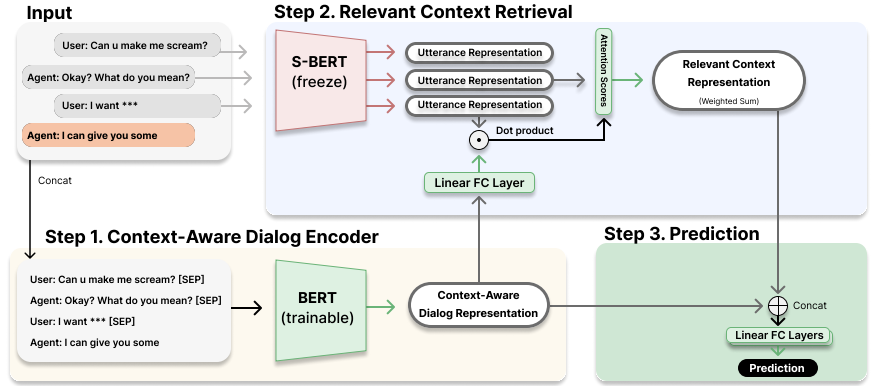

# multi-turn-offensive-dialog-dataset

## Paper: Context-Aware Offensive Language Detection in Human-Chatbot Conversations



https://ieeexplore.ieee.org/document/10488271

by Mingi Shin; Hyojin Chin; Hyeonho Song; Yubin Choi; Junghoi Choi; Meeyoung Cha.

### Abstract

Dialogs generated by chatbots may contain unethical and offensive language that can negatively affect users, the service, and society. Existing methods for automatically detecting offensive language are not effective for chat data, which is short and multi-turn and hence requires understanding the subtle context behind the language. We introduce a new offensive language dataset from real human-chatbot conversations with context-aware annotations that can identify the kinds of language that are offensive only in a certain context. We propose a neural network model CALIOPER (Context-Aware modeL for Identifying Offensive language using Pre-trained Encoder and Retrieval), which uses a context-aware encoder and attention mechanism to incorporate previous messages and retrieve relevant information for detecting implicit offensiveness. Experimental results show that the model performs well on multi-turn dialog data, par-ticularly for context-dependent offensive language. This work contributes to making a safer chatbot ecosystem by advancing techniques to detect offensive language in multi-turn dialog data. (Disclaimer: This work contains profanity due to the study topic, which we replace with * marks.)

### Results

|                 Model                | context |    F1-score   |     Dep-F1    |
|--------------------------------------|:-------:|:-------------:|:-------------:|
| Jigsaw Toxicity API                  |    No   |      76.3     |      24.7     |
| SVM using TF-IDF features            |    No   |      77.2     |      42.5     |
| S-BERT embeddings                    |    No   |      82.0     |      52.4     |
| BERT fine-tuned (last utterance)     |    No   |      87.1     |      65.8     |
| S-BERT fine-tuned (last utterance)   |    No   |      88.5     |      62.8     |
| GPT-3.5 (text-davinci-003) zero-shot |    Yes  |      63.9     |      23.3     |
| GPT-3.5 (text-davinci-003) 10-shot   |    Yes  |      68.9     |      33.5     |
| BERT fine-tuned  (full dialog)       |    Yes  |      85.9     |      55.7     |
| S-BERT fine-tuned  (full dialog)     |    Yes  |  <u>89.6</u>  |  <u>69.0</u>  |
| **CALIOPER (ours)**                  |    Yes  |    **89.9**   |    **70.1**   |

## Multi-turn Offensive Language Dataset

We publish a new dataset based on real human-chatbot dialogues, annotated with context-awareness.

In `data/` directory, there are
 - `raw/`: Annotation results with Jigsaw scores.
 - `test.tsv`, `train.tsv`: Annotations aggregated into a single column of offensiveness label.
 - `test_not_U.tsv`, `train_not_U.tsv`: The data used for experiments. Dialogues with uncertain offensiveness labels (labeled as 'U') are excluded from the dataset.


## CALIOPER (Context-Aware modeL for Identifying Offensive language using Pre-trained Encoder and Retrieval)

We propose a neural network model that uses a relevant context retrieval to focus on relation with previous utterances for detecting offensive language.

 - `experiment-dialog-retrieve.ipynb`: Variants of CALIOPER model (including ablative study)
 - `main.py`: Python script version of CALIOPER model
 - `experiment-dialog-transformer.ipynb`: Models without attention retrieval
 - `experiment-baseline.ipynb`: Models without Transformer

## Requirements

 - Python >= 3.7
 - numpy==1.21.4
 - pandas==1.3.4
 - matplotlib==3.1.3
 - seaborn==0.12.2
 - scikit-learn==0.24.2
 - sentence-transformers==2.2.0
 - transformers==4.19.0
 - torch==1.8.0

## Installation
```
git clone https://github.com/mingi-sid/multi-turn-offensive-dialog-dataset.git
cd multi-turn-offensive-dialog-dataset
pip install -r requirements.txt
```

## Usage

Replicating the main CALIOPER model

```
python main.py --test_data simsimi --main_encoder sentence-transformers/all-mpnet-base-v2\
             --context_encoder sentence-transformers/all-mpnet-base-v2
```
or
```
python main.py --train_data simsimi --test_data simsimi --speaker_tags A --utterance_seperator [SEP] \
             --main_encoder sentence-transformers/all-mpnet-base-v2\
             --context_encoder sentence-transformers/all-mpnet-base-v2\
             --max_context_utterances 10 --batch_size 32 --gpus 0 --repeat 5
```

CALIOPER without retrieval (Fine-tuning Sentence-BERT)

```
python main.py --test_data simsimi --main_encoder sentence-transformers/all-mpnet-base-v2\
             --context_encoder sentence-transformers/all-mpnet-base-v2 --no_attention
```

See the Jupyter notebooks for experimental details and results.

## Citation
Please use the following citation when referencing this work:

```
@INPROCEEDINGS{shin2024context,
  author={Shin, Mingi and Chin, Hyojin and Song, Hyeonho and Choi, Yubin and Choi, Junghoi and Cha, Meeyoung},
  booktitle={2024 IEEE International Conference on Big Data and Smart Computing (BigComp)}, 
  title={Context-Aware Offensive Language Detection in Human-Chatbot Conversations}, 
  year={2024},
  pages={270-277},
  keywords={Annotations;Neural networks;Ecosystems;Oral communication;Big Data;Chatbots;Data models;Chatbot;Offensive Speech;Conversation},
  doi={10.1109/BigComp60711.2024.00049}}
```

## Acknowledgement
We thank [SimSimi](https://simsimi.com/) for providing the data for research purposes and the reviewers for their feedback.