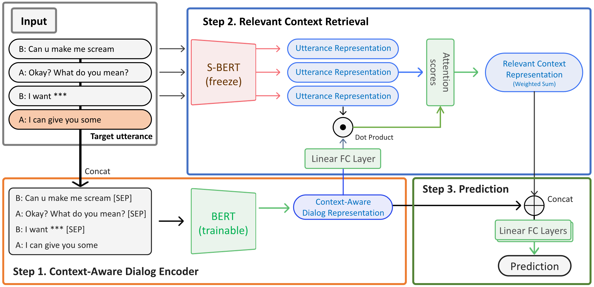

# Context-Aware Offensive Language Detection in Human-Chatbot Conversations

## Paper

https://ieeexplore.ieee.org/document/10488271

Dialogs generated by chatbots may contain unethical and offensive language that can negatively affect users, the service, and society. Existing methods for automatically detecting offensive language are not effective for chat data, which is short and multi-turn and hence requires understanding the subtle context behind the language. We introduce a new offensive language dataset from real human-chatbot conversations with context-aware annotations that can identify the kinds of language that are offensive only in a certain context. We propose a neural network model CALIOPER (Context-Aware modeL for Identifying Offensive language using Pre-trained Encoder and Retrieval), which uses a context-aware encoder and attention mechanism to incorporate previous messages and retrieve relevant information for detecting implicit offensiveness. Experimental results show that the model performs well on multi-turn dialog data, par-ticularly for context-dependent offensive language. This work contributes to making a safer chatbot ecosystem by advancing techniques to detect offensive language in multi-turn dialog data. (Disclaimer: This work contains profanity due to the study topic, which we replace with * marks.)


## simsimi-multi-turn-offensive-language-dataset

```
data/
test.tsv
test_not_U.tsv
train.tsv
train_not_U.tsv
```


## CALIOPER (Context-Aware modeL for Identifying Offensive language using Pre-trained Encoder and Retrieval)



```
README.md
experiment-baseline.ipynb
experiment-dialog-retrieve.ipynb
experiment-dialog-transformer.ipynb
```

## Requirements

 - Python >= 3.7
 - numpy==1.21.4
 - pandas==1.3.4
 - matplotlib==3.1.3
 - seaborn==0.12.2
 - scikit-learn==0.24.2
 - sentence-transformers==2.2.0
 - transformers==4.19.0
 - torch==1.8.0

## Installation
```
git clone https://github.com/mingi-sid/multi-turn-offensive-dialog-dataset.git
cd multi-turn-offensive-dialog-dataset
pip install -r requirements.txt
```

## Usage

See the Jupyter notebooks for experimental details and results.

## Citation
Please use the following citation when referencing this work:

```
@INPROCEEDINGS{shin2024context,
  author={Shin, Mingi and Chin, Hyojin and Song, Hyeonho and Choi, Yubin and Choi, Junghoi and Cha, Meeyoung},
  booktitle={2024 IEEE International Conference on Big Data and Smart Computing (BigComp)}, 
  title={Context-Aware Offensive Language Detection in Human-Chatbot Conversations}, 
  year={2024},
  pages={270-277},
  keywords={Annotations;Neural networks;Ecosystems;Oral communication;Big Data;Chatbots;Data models;Chatbot;Offensive Speech;Conversation},
  doi={10.1109/BigComp60711.2024.00049}}
```